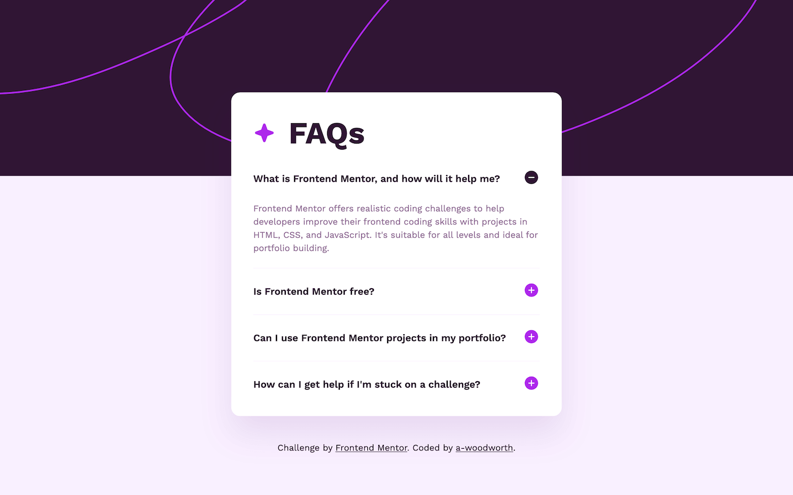
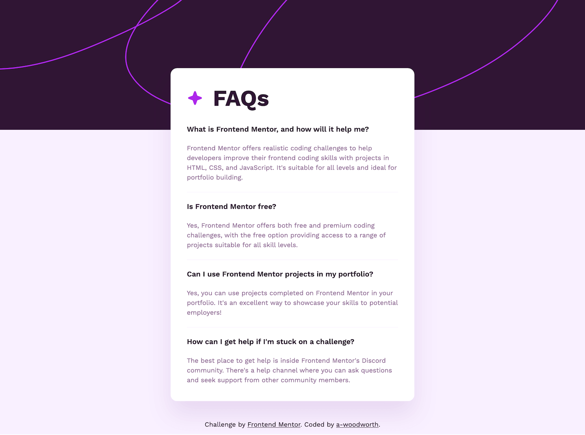
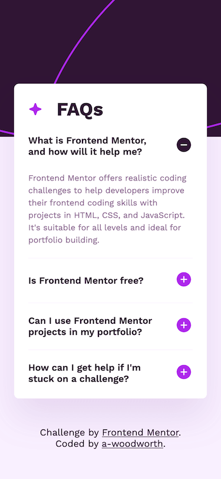

# Frontend Mentor - FAQ accordion solution

This solution to the [FAQ accordion challenge on Frontend Mentor](https://www.frontendmentor.io/challenges/faq-accordion-wyfFdeBwBz) features an accessible accordion using progressive enhancement. Accordion will display fully open, showing all content, if JavaScript is disabled or not working.

## Table of contents

- [Overview](#overview)
  - [The challenge](#the-challenge)
  - [Screenshots](#screenshots)
  - [Links](#links)
  - [Built with](#built-with)
  - [Native HTML solution](#native-html-solution)

## Overview

### The challenge

Users should be able to:

- Hide/Show the answer to a question when the question is clicked
- Navigate the questions and hide/show answers using keyboard navigation alone
- View the optimal layout for the interface depending on their device's screen size
- See hover and focus states for all interactive elements on the page

### Screenshots

**Desktop**

**No JavaScript Version - Desktop**

**Mobile**

### Links

- Solution URL: [Solution]()
- Live Site URL: [Live Site](https://a-woodworth.github.io/faq_accordion_v2)

### Built with

- Semantic HTML5 markup
- CSS Custom properties (variables)
- JavaScript
- Fade-in animation when accordion opens

### Native HTML solution

Interested in how I built this accordion using the `
` and `
` tags? View my [HTML solution](https://github.com/a-woodworth/faq_accordion) here.
